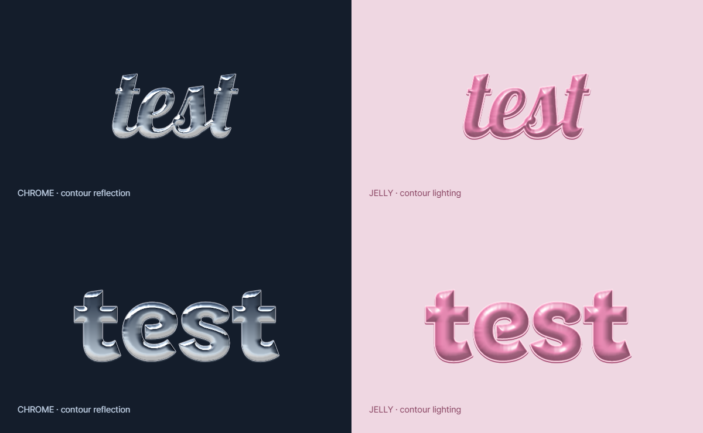

# DOTLAB 사진 편집실

사진에 효과·글자·펀칭·누끼 스티커를 더하는 브라우저 편집기입니다. 빈 화면에서 내 사진을 불러와 시작합니다. 편집 사진과 사용자 폰트는 서버로 업로드하지 않습니다.



## GitHub Pages에 올리기

1. ZIP을 풀어 **이 폴더 안의 파일과 폴더 전체**를 저장소 최상위에 올립니다. 웹 업로드는 먼저 `assets/`와 `preview/` 폴더를 올리고, 다음 업로드에서 나머지 파일을 올리면 됩니다. 저장소에서 바로 `index.html`이 보여야 합니다.
2. Settings → Pages → Build and deployment에서 **Deploy from a branch**를 선택합니다.
3. 브랜치는 **main**, 폴더는 **/(root)**로 정하고 Save를 누릅니다.
4. 배포가 끝나면 Pages에 표시된 주소를 엽니다.

ZIP 파일 자체를 올리는 대신 압축을 푼 내용을 올려주세요. JavaScript, CSS, `assets/`가 필요하므로 index.html만 단독으로 올리면 동작하지 않습니다. 빌드·npm 설치·API 키는 필요하지 않습니다.

[GitHub 공식 배포 안내](https://docs.github.com/en/pages/getting-started-with-github-pages/configuring-a-publishing-source-for-your-github-pages-site)

## 로컬 실행

Python 3이 설치된 환경에서 이 폴더를 열고 다음 명령을 실행합니다.

```sh
python -m http.server 4178 --bind 127.0.0.1
```

브라우저에서 http://127.0.0.1:4178/ 로 접속합니다. HTML을 더블클릭하는 file:// 실행은 지원하지 않습니다.

## 사용법

- **사진 효과:** 효과·강도·적용 부위를 고르고 레이어를 추가해 중첩합니다.
- **누끼:** 사진/사물은 고화질 모드, 캐릭터/게임 사진은 캐릭터 모드로 분석합니다. 기울어진 캐릭터를 여러 방향으로 분석하는 옵션도 있습니다. **누끼 정도 조절**에서 배경 제거 강도·경계 넓히기/줄이기·가장자리 부드러움을 바로 조절하고 초기화할 수 있습니다. 브러시 크기가 커서에 표시되며 다듬는 동안 사진은 움직이지 않습니다. 다른 탭으로 이동하면 선택 표시가 숨겨지고, 수정한 마스크가 기존 콜라주 피사체에도 반영됩니다.
- **펀칭:** 직접 펀칭 시작 → 사진에 도형 찍기 → 옆 색상판의 조각 이동/정렬. 조각을 옮겨도 처음 오린 사진 부분이 유지됩니다. 우클릭 또는 Delete로 삭제합니다. 크기·회전·색상·그라데이션·배치를 조절할 수 있습니다.
- **글자:** 글자를 입력하고 폰트를 고른 다음 효과 템플릿을 적용합니다. 외곽선·입체·광택·자간·행간을 별도로 조절합니다.
- **기호/스티커:** 직접 찍기로 기호를 미리 보고 배치하거나 내 사진으로 스티커를 만듭니다.
- **사진/프레임:** 디카 색상, 프레임, 피사체 콜라주, 화면 비율을 바꿉니다. 그린 스크랩 콜라주는 초록 종이·찢은 흰 종이·파란 글자, 크림 오브젝트 콜라주는 크림 종이·짙은 초록 오림 테두리·타자기 글자로 구성됩니다. 추가한 사진 스티커도 개별 레이어로 배치합니다.
- **이동과 크기:** 사진은 드래그·휠, 글자와 스티커는 드래그·모서리·회전 손잡이로 조절합니다.
- **저장:** 이미지 저장은 완성 이미지, 작업 저장은 다시 편집하는 .dotlab 파일입니다. Ctrl/⌘+Z로 실행 취소합니다.

## 파일과 네트워크

`index.html`은 시작 페이지, `app.js`는 조작, `renderer.js`는 합성, `manual-punch.js`는 직접 펀칭, `material-text.js`는 크롬·젤리 글자 효과를 담당합니다. `assets/`에는 폰트·모델·WASM과 라이선스가 들어 있습니다. 전체 배포물은 압축 전 약 490MB입니다. 고화질 누끼 모델은 약 192MB, 캐릭터 모델은 약 176MB이며 해당 모드로 분석할 때 불러옵니다. 로컬 Chrome 테스트에서 캐릭터 다방향 분석은 약 40~60초 걸렸고, 기기와 네트워크에 따라 달라집니다. 빠른 분석 모드는 작은 모델을 사용합니다.

머니그라피 두 글꼴은 토스 공식 서버에서 불러옵니다. 해당 서버 연결이 제한되면 그 글꼴은 준비되지 않을 수 있습니다. 나머지 배포 자산은 같은 사이트에서 불러옵니다. 폰트·모델 출처와 조건은 [폰트와 출처](credits.html)를 확인해주세요. 재배포가 제한된 글꼴은 내 폰트 파일 연결 방식입니다.

## 구현 범위

자동 누끼와 얼굴 감지는 사진에 따라 누락이나 배경 잔여가 생길 수 있습니다. 제공된 두 캐릭터 사진에서는 새 캐릭터 모드로 두 얼굴과 몸통이 보존되고, 검사한 양옆 배경 지점이 투명해지는 것을 확인했습니다. 모든 사진에서 같은 품질을 보장하지 않습니다. 강도 조절과 브러시·둘러서 선택 및 얼굴 영역 직접 지정을 함께 사용할 수 있습니다.

템플릿과 효과는 편집 가능한 Canvas 렌더링입니다. 참고 이미지와 동일한 결과를 보장하지 않습니다. 직접 펀칭은 [ButterPunch](https://coconopeman.github.io/ButterPunch/)의 조작을 참고해 독립 구현했으며, 원 사이트와 제휴하지 않았습니다. 카메라·장식 프레임은 이 작업에서 생성한 자산입니다. 사용자 참고 사진과 테스트 사진은 배포물에서 제외했습니다.
